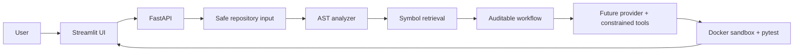

# Agentic Software Engineer

An explainable, safety-first MVP of a coding agent for small Python repositories. It accepts a ZIP, one or more Python files, or a public GitHub repository; maps the code with Python AST; retrieves relevant symbols; produces an auditable plan; and shows every public activity event in a professional Streamlit workspace.

## What works today

- Safe ZIP validation and extraction (including path-traversal protection)
- One or more loose `.py` file uploads, with safe filenames and size limits
- Temporary repository workspaces survive a FastAPI restart during local development
- Test execution uses the durable repository workspace, not an expired task ID
- SQLite task persistence, including activity events, diff, test results, and review
- Public HTTPS GitHub clone with repository file limits
- Python AST extraction of classes and functions with source locations
- AST semantic chunks, hybrid lexical/API embedding retrieval, and isolated FAISS namespaces
- FastAPI backend and Streamlit user interface
- Typed task, event, repository, and test contracts
- Provider interface, model metadata, and capability-aware fallback router
- Constrained coding node: structured model edits, exact replacements, and a visible unified diff
- Validated read/create/exact-edit filesystem tools for future coding agents
- Docker-only test executor with network disabled, resource limits, timeout,
  and a strict command allowlist
- Controlled dependency preparation for ordinary package requirements, without
  copying or executing repository source during Docker image preparation
- Clear distinction between failing tests and a repository with no collected tests
- Bounded self-correction loop: pytest failures are returned to the coding provider
  for a validated retry, up to the user-selected iteration limit
- Runtime provider fallback: the next compatible provider is used only after a
  real active-provider failure
- Typed planner, test-agent, and evidence-based reviewer phases

The **Maximum agent attempts** control includes the initial implementation.
Choose at least `2` to allow one automatic correction after a test failure.
- Honest provider gate: no model configured means no invented edits, tests, or success claim

## Why the provider gate matters

The PRD requires real agent work rather than simulated results. With a configured provider, this app asks for structured edits, applies them only through constrained file tools, and attaches the real diff. Tests still require Docker to be available.

## UI tour

1. **Sidebar — Provider status:** tells you whether implementation can start. It never displays keys or invented quota data.
2. **New task:** upload a Python ZIP, select one or more `.py` files, or provide a public GitHub URL. Then describe the requested change and set the correction budget.
3. **Agent workspace:** a concise activity timeline shows observable milestones, not private chain-of-thought. The plan explains intended work and Retrieved code lists the functions/classes selected for context.
4. **Review area:** shows why the task has paused or, once a provider is connected, the real review result.

## Run locally

```bash
uv venv
uv pip install -e ".[dev]"
uv run uvicorn app.main:app --reload --reload-dir app
# In another terminal:
uv run streamlit run ui/streamlit_app.py
```

Open the Streamlit URL shown in the terminal. Copy `.env.example` to `.env` to
customize limits and configure either `HUGGINGFACE_API_KEY` or
`MISTRAL_API_KEY`. Set `HUGGINGFACE_MODEL` or `MISTRAL_MODEL` when using a
different model. Configured providers are health-checked at startup; keys are
never returned by the status endpoint.

## Architecture



## Benchmark Results

Evaluated against **10 deterministic fixture tasks** across four engineering
categories using the `benchmarks/` evaluation suite.
Run `uv run python benchmarks/run_dry.py` to reproduce.

> **Baseline**: deterministic fixture run — no live model required.
> Live model results will vary by provider and model choice.

| Metric | Value |
| :--- | :--- |
| **Total Tasks** | 10 |
| **Task Success Rate** | 100.0% (10/10) |
| **Self-Correction Rate** | 0.0% (0 corrected) |
| **Average Iterations** | 1.00 |

### Category Breakdown

| Category | Total | Passed | Success Rate |
| :--- | :--- | :--- | :--- |
| Bug Fixing | 4 | 4 | 100.0% |
| Feature Implementation | 3 | 3 | 100.0% |
| Test Generation | 2 | 2 | 100.0% |
| Refactoring | 1 | 1 | 100.0% |

Full task-level results: [`benchmarks/baseline_results.md`](benchmarks/baseline_results.md)

## Security and limitations

This is an MVP for local development. Tests are executed only through Docker and will report an environment error when Docker is unavailable. Deploy only after reviewing [`DEPLOYMENT.md`](DEPLOYMENT.md) for production hardening guidance. GitHub cloning requires network access and only accepts public `https://github.com` URLs.

