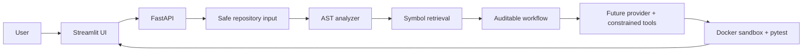

# Agentic Software Engineer

An explainable, safety-first MVP of a coding agent for small Python repositories. It accepts a ZIP, one or more Python files, or a public GitHub repository; maps the code with Python AST; retrieves relevant symbols; produces an auditable plan; and shows every public activity event in a professional Streamlit workspace.

## What works today

- Safe ZIP validation and extraction (including path-traversal protection)
- One or more loose `.py` file uploads, with safe filenames and size limits
- Public HTTPS GitHub clone with repository file limits
- Python AST extraction of classes and functions with source locations
- Dependency-free lexical retrieval of relevant symbols
- FastAPI backend and Streamlit user interface
- Typed task, event, repository, and test contracts
- Provider interface, model metadata, and capability-aware fallback router
- Validated read/create/exact-edit filesystem tools for future coding agents
- Docker-only test executor with network disabled, resource limits, timeout,
  and a strict command allowlist
- Honest provider gate: no model configured means no invented edits, tests, or success claim

## Why the provider gate matters

The PRD requires real agent work rather than simulated results. This starter does not ship a hard-coded provider or API key. The workflow therefore completes analysis and pauses at `needs_provider`; a future provider adapter must make actual model calls, use constrained file tools, run tests in Docker, and attach the real diff and review.

## UI tour

1. **Sidebar — Provider status:** tells you whether implementation can start. It never displays keys or invented quota data.
2. **New task:** upload a Python ZIP, select one or more `.py` files, or provide a public GitHub URL. Then describe the requested change and set the correction budget.
3. **Agent workspace:** a concise activity timeline shows observable milestones, not private chain-of-thought. The plan explains intended work and Retrieved code lists the functions/classes selected for context.
4. **Review area:** shows why the task has paused or, once a provider is connected, the real review result.

## Run locally

```bash
uv venv
uv pip install -e ".[dev]"
uv run uvicorn app.main:app --reload
# In another terminal:
uv run streamlit run ui/streamlit_app.py
```

Open the Streamlit URL shown in the terminal. Copy `.env.example` to `.env` to customize limits.

## Architecture



## Next implementation milestones

1. Add real provider adapters to the existing `LLMProvider` interface and registry.
2. Replace lexical retrieval with independently routed embedding providers and isolated FAISS namespaces.
3. Wire the existing Docker test executor and validated patch tools into a coding node.
4. Add LangGraph correction nodes, SQLite persistence, diff export, and benchmark fixtures.

## Security and limitations

This is an MVP for local development. Tests are executed only through Docker and will report an environment error when Docker is unavailable. Deploy only after task cleanup, authentication/rate limits, provider adapters, and dependency-preparation caching are implemented. GitHub cloning requires network access and only accepts public `https://github.com` URLs.
